# Inclusive Agentic Architecture Template
*Building Inclusive, Modular, and Agentic Platforms for Education, Healthcare, and Accessibility*

---

## 1. Abstract

This whitepaper presents an **inclusive, agentic architecture** designed to enable **scalable**, **modular**, and **human-centred AI systems** across domains such as **education**, **healthcare**, and **accessibility**.

Current digital ecosystems are **fragmented**, leading to duplication, limited reuse, and difficulty in scaling innovations.  
The proposed framework unifies these efforts through a **layered reference architecture** — comprising **integration channels**, **experience orchestration**, **business logic**, **agent libraries**, and **tool adapters** under an **open and extensible model**.

The architecture emphasizes **inclusivity**, ensuring accessibility via **multimodal channels** such as mobile, feature phones, and assistive devices.  It also embeds **security, auditability, and compliance guardrails** upfront.

---

## 2. Motivation

- Current solutions are point-specific and lack a unified reference model.  
- Fragmentation challenge: Similar patterns solved differently → difficult to reuse, scale, or maintain.  
- Need for a **common architectural template** that:
  - Reduces duplication of effort across projects.  
  - Ensures scalability & reliability during usage surges.  
  - Simplifies integration of new datastores and connectors.  
  - Embeds security, auditability, and compliance guardrails upfront.  

**Long-term Vision:**  
A **community-driven reference architecture** that improves developer onboarding, speeds up experimentation, and ensures enterprise-grade resilience.

---

## 3. High-Level Layered Architecture


*Figure 1: High-Level Agentic Architecture Template*

---

## 4. Components of the Architecture

### 4.1 Integration Layer

Serves as the **system’s backbone for connectivity and interoperability**.  
It manages authentication, auditing, and compliance across integrations.  
Main goal: make external data feel internal while maintaining **isolation and control**.

#### Channels for Access
Supports:
- Mobile applications  
- Feature phone–based telecommunications  
- Web interfaces  
- Assistive devices (e.g., Hexis, Iris)  
- Messaging interfaces (WhatsApp, Telegram, SMS)

#### Data Flow Example


---

### Experience Layer (with User, Conversation and Memory)

Acts as the **central user interaction entry point**, normalizing inputs from diverse channels for unified downstream handling.  
It enriches the data with **context**, **authentication**, and **personalization cues**, and formats output for the appropriate channel.

#### Example Data Flow

#### Data Flow



```mermaid
sequenceDiagram
    autonumber
    participant User
    participant IntegrationLayer
    participant ExperienceLayer
    participant BusinessOrchestration

    User->>IntegrationLayer: Sends message via channel adapter <br/>(text, audio, button click)
    IntegrationLayer->>ExperienceLayer: Enriched, authenticated input
    Note right of ExperienceLayer: Create <br/>`standard_request` JSON <br/>with metadata:<br/>• channel_type<br/>• user_id<br/>• locale<br/>• timestamp<br/>• raw_content
    ExperienceLayer->>BusinessOrchestration: Forward structured request<br/>via REST or Message Bus
```

Sample json
```
{
  "standard_request": {
    "channel_type": "whatsapp",
    "user_id": "ASHA_908",
    "locale": "bn",
    "timestamp": "2025-10-08T08:20:30Z",
    "content": "What are the symptoms of dengue?"
  }
}
```

#### Example Memory Query
```json
{
  "user_id": "ASHA_908",
  "context_type": "conversation_summary"
}
```

Response:
```json
{
  "last_session_date": "2025-10-01",
  "topics_discussed": ["child vaccination", "vaccine application"],
  "pending_action": "confirm new date",
  "raw_messages": [{
       ...
       "source": "whatsapp",
       ...
   }]
}
```

The Experience Layer forwards this normalized structure to the Business Orchestration Layer.

---

### 4.2 Business & Agentic Orchestration Layer

Implements **domain-level logic** through a hybrid of **deterministic services** and **agentic orchestration**.

- **Business Services:** Integrate user information, manage persistent data, and handle workflows.  
- **Agent-Oriented Orchestration:** Delegates reasoning and transformation tasks to agents.

In effect, it acts as the “brain” for domain behaviour, handling branching logic, fallback, error handling, and domain-specific rules or constraints.


### Agent Library

Agents operate as autonomous reasoning nodes that receive and emit structured events. 
Each agent processes data and can be chained in different order enabling concurrent reasoning and flexible delegation without direct coupling.

Encapsulates **AI reasoning and cognitive tasks** into reusable "agents", allowing complex system logic to be broken into small, composable and reusable "units of work".

| Agent Type | Function | Example Use Case |
|-------------|-----------|------------------|
| RAG | Retrieval-Augmented Generation | Query knowledge base |
| Translation | Multilingual Interaction | Local language conversion |
| ASR/TTS | Speech Processing | IVR / audio channels |
| Consensus Evaluator | Group agreement logic | Feedback loops |
| Data Sanity | Validation and safety | Input consistency |

Each agent defines **input/output contracts** and **performance expectations** for interoperability.

**Lifecycle and Agent Invocation**

Step 1: Registered in the central Agent Registry under a versioned identifier.

Step 2: Invoked by an Orchestrator or another agent based on workflow logic.

Step 3: Executed with full context (user/session/memory data).

Step 4: Returns standardized output for downstream agents or final rendering.


### Tool Library

Tools are **deterministic connectors** or **adapters** that perform actions or I/O without reasoning.

| Tool | Purpose | Example |
|------|----------|----------|
| WhatsApp Adapter | Messaging | Send notifications |
| IVR Gateway | Telephony | Play prompts |
| Email Tool | Communication | Send updates |
| CRM Adapter | External Systems | Update lead data |
| MongoDB Adapter | Storage | Persist structured data |

```
sequenceDiagram
    autonumber
    participant Agent
    participant ToolRegistry
    participant WhatsAppAdapter
    participant ExternalAPI

    Agent->>ToolRegistry: Lookup("whatsapp_adapter:v2")
    ToolRegistry-->>Agent: Return schema + endpoint
    Agent->>WhatsAppAdapter: Send(recipient="+91XXXX", template="notify_schedule")
    WhatsAppAdapter->>ExternalAPI: POST /messages
    ExternalAPI-->>WhatsAppAdapter: {status: "success", id: "wa_001"}
    WhatsAppAdapter-->>Agent: status=success, timestamp
```

#### Example Tool Invocation
```json
{
  "tool": "whatsapp_adapter",
  "action": "send_message",
  "recipient": "+91XXXXXXXXXX",
  "message": "Your vaccination is scheduled for 12 Oct at 10 AM.",
  "template_id": "notify_schedule"
}
```

**Real World Example: Sahayak Orchestrator**

The Sahayak Orchestrator exemplifies how these architectural layers operate in unison.
 - It receives user inputs—along with historical context and session memory—and determines which agents or tools should act next.
 - Using its centralized Tool Registry, populated with system-level MCP (Multi-Channel Plugin) abstractions, the orchestrator dynamically routes requests to the appropriate agents for reasoning and to the corresponding tools for deterministic execution.
 - This event-driven workflow enables Sahayak to coordinate human-like reasoning with system-level precision, ensuring adaptive, multimodal interactions across channels and services.


---

### 4.3 Ingestion Layer

converts raw or semi-structured content (textbooks, media, logs) into enriched, searchable knowledge representations for downstream agents. Supports **high-throughput ingestion**, **context caching**, and **long-term knowledge storage**.

#### Data Flow



```mermaid
flowchart LR
    A[1️⃣ Ingestion Trigger] --> B[2️⃣ Data Retrieval]
    B --> C[3️⃣ Parsing & Preprocessing]
    C --> D[4️⃣ Chunking & Metadata Enrichment]
    D --> E[5️⃣ Embedding & Indexing]
    E --> F[6️⃣ Storage & Caching]
    F --> G[7️⃣ Event Logging & Completion]
```

Ingestion layer relies heavily on the agent and tool libraries preprovisioned. Sample examples

| Type                       | Responsibility                                             | Example Components                                  |
| -------------------------- | ---------------------------------------------------------- | --------------------------------------------------- |
| **Parser Agent**           | Handles parsing, cleaning, extraction logic.               | `TextExtractionAgent`, `SpeechToTextAgent`          |
| **Chunking Agent**         | Segments and structures data.                              | `ChunkingAgent`, `ContentSplitterTool`              |
| **Embedding Agent**        | Generates semantic embeddings from processed text.         | `EmbeddingAgent`, `OpenAIEmbeddingTool`             |
| **Storage / Memory Tools** | Persist processed data into memory or vector DBs.          | `VectorDBTool`, `KnowledgeBaseAdapter`, `CacheTool` |
| **Logging & Audit Agents** | Maintain ingestion logs, telemetry, and versioned lineage. | `IngestionLoggerAgent`, `TelemetryCollectorTool`    |


---

## 5. Real-World Applications

### Education
- Teachers can aggregate lesson plans, generate evaluations, and access learning content through multilingual and multimodal channels.

### Healthcare
- Field health workers (ASHAs/ANMs) can report via WhatsApp or IVR, enabling data capture and alerts in remote areas.

### Accessibility
- Voice and assistive-device-based interfaces ensure participation for users with disabilities or low-tech environments.

---

## 6. 🎯 Design Principles
---
| 🧩 Principle | 💡 Description | 🔗 Implication |
|--------------|----------------|----------------|
| 🌐 **Open Source First** | Built to evolve collaboratively and transparently. | Encourages community contributions and shared innovation. |
| 🧱 **Highly Modular** | Each capability functions as a reusable component or library. | Simplifies updates, enables team-specific extensions. |
| ⚖️ **Horizontally Scalable** | Designed for distributed, cloud-native scaling. | Supports large concurrent workloads and adaptive scaling. |
| ♿ **Inclusive & Multimodal** | Accessible via text, voice, and assistive devices. | Ensures equitable access across digital divides. |
| 🤖 **AI-First** | Agentic reasoning and cognitive workflows by design. | Enables contextual automation and hybrid human-AI work. |
| 🔒 **Secure by Design** | Data flow and access control built into architecture. | Simplifies compliance, auditability, and data governance. |
| 🔌 **Plug & Play** | Extensible via standardized connectors and APIs. | Allows rapid onboarding of new channels or services. |

> 💬 *These principles form the DNA of the Agentic Template — ensuring it stays modular, scalable, and inclusive across domains.*

## 7. Limitations & Future Considerations

- **Complex Orchestration**: Debugging multi-agent workflows may be non-trivial.  
- **Connectivity Dependency**: Cloud-dependent features (RAG, ASR/TTS) may face offline limitations.  
- **Tool Explosion**: Too many tools risk hallucinated abilities. Guardrails and observability layers are essential.  
- **Maintenance Overhead**: Hybrid agentic-service systems require continuous synchronization and version management.
- **Evolving Standards**: Interoperability may drift with external APIs and / or AI model changes

---

## 8. References

- *Inclusive Architecture Whitepaper (2025)*  
- *Architecture Template (Draft, A4I, Aug 2025)*  
- Microsoft Azure AI & Cognitive Services Documentation  
- OpenAI Function Calling & Orchestration Patterns (2024)  
- WHO Digital Health Guidelines (2023)

---

© 2025 A4I. All Rights Reserved.
